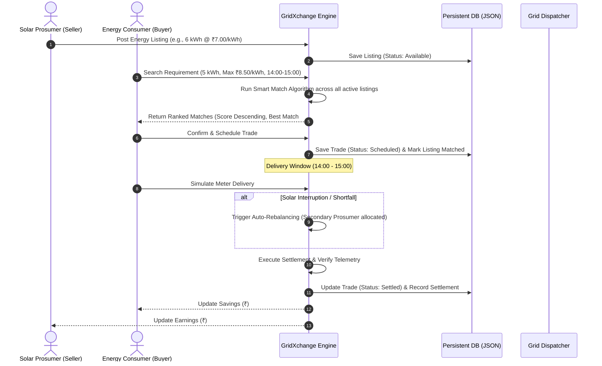

# GridXchange ⚡ — Decentralized P2P Renewable Energy Trading Platform

[](https://coordinated-currently-judy-courier.trycloudflare.com)
[](https://www.typescriptlang.org/)
[](https://react.dev/)
[](https://expressjs.com/)
[](https://tailwindcss.com/)

> **Live Demo URL**: [https://coordinated-currently-judy-courier.trycloudflare.com](https://coordinated-currently-judy-courier.trycloudflare.com)

---

## 📌 Executive Summary

**GridXchange** is a next-generation peer-to-peer (P2P) renewable energy marketplace designed to enable local energy trading between rooftop solar prosumers and neighboring consumers. By leveraging predictive solar forecasting, a multi-factor smart matching engine, dynamic locational pricing, and automated grid rebalancing, GridXchange reduces electricity bills by 20–30% for consumers while increasing returns for solar producers.

---

## 🎯 The Problem

1. **Sub-optimal Feed-in Tariffs**: Residential and commercial rooftop solar producers often receive low compensation (feed-in tariffs) for excess electricity fed back into the central grid.
2. **High Retail Electricity Costs**: Nearby consumers pay high peak-hour retail rates to traditional utilities, even when surplus solar energy is generated right next door.
3. **Distribution Grid Congestion & Intermittency**: Sudden solar generation drops due to cloud cover cause grid voltage fluctuations, requiring expensive dispatch interventions.
4. **Lack of Local Marketplace Infrastructure**: Consumers have no transparent mechanism to discover, bid on, or purchase verified green energy directly from their neighbors.

---

## 💡 The Solution

GridXchange decentralizes energy distribution through a localized, intelligence-driven marketplace:

- **Direct P2P Trading**: Prosumers list excess kilowatt-hours (kWh); consumers match and lock delivery windows directly.
- **Explainable Smart Matching**: A 6-parameter scoring algorithm ranks all active local producers in descending score order.
- **Dynamic Locational Marginal Pricing**: Prices adjust automatically based on base rate, real-time demand, supply surplus, and feeder congestion levels.
- **Automated Rebalancing**: Secondary prosumers automatically compensate for intermittent solar shortfalls without interrupting consumer delivery.
- **Meter-Verified Settlements**: Telemetry-driven settlement credits sellers and calculates buyer savings immediately upon simulated delivery.

---

## 🚀 Key Features

### 1. 🔍 Dynamic Multi-Prosumer Discovery & Ranking
- Consumers query all active listings available across neighborhood grid zones.
- The **Smart Match Score (0–100%)** evaluates every active prosumer and displays them in descending score order.
- The highest-ranking match is marked with the **BEST MATCH** badge along with an explainable reason checklist (proximity, surplus volume, reliability, price, and grid health).

### 2. 📈 Dynamic Locational Pricing Engine
- Formula: $\text{Final Price} = \text{Base Price} + \text{Demand Factor} + \text{Supply Factor} + \text{Congestion Surcharge}$
- Low-congestion zones (Zone A) incur ₹0.00 surcharge, while high-congestion feeders (Zone C) reflect real-time grid conditions.

### 3. ☀️ Solar Forecasting & Telemetry
- Pre-computes near-term solar irradiance curves and predicted generation vs. consumption to forecast available surplus before the trading window opens.

### 4. ⚡ Automated Grid Shortfall Rebalancing
- If a primary seller experiences generation shortfalls (e.g., sudden cloud cover), the system automatically allocates secondary backup prosumers in the same or adjacent zone to deliver the missing energy.

### 5. 💳 Meter-Verified Settlement & Delivery Simulator
- Instant trade execution testing via simulated smart meter delivery.
- Updates wallet balances, buyer lifetime savings, and seller earnings with full audit persistence.

### 6. 🛡️ Grid Dispatcher Control Room (Admin)
- Real-time monitoring of all community metrics: total traded kWh, active participants, aggregate financial savings, and zone congestion toggles.

### 7. 💾 Persistent Storage Layer
- Synchronous disk-backed database (`server/data/database.json`) ensures user registrations, active listings, scheduled trades, and settlements persist across refreshes and server restarts.

---

## 👥 User Roles & Personas

| Role | Capabilities | Primary Persona |
| :--- | :--- | :--- |
| **Prosumer** | • View generation, consumption & forecasted surplus<br>• Create and manage energy listings (kWh & ₹/kWh)<br>• Track completed trades & lifetime earnings | *SunPower Apex (P001)* |
| **Consumer** | • Configure energy requirement (kWh, time window, budget)<br>• Review ranked prosumer matches (Best Match first)<br>• Schedule trades and simulate meter verification<br>• Track energy savings vs. utility benchmark | *Ananya Sharma (C001)* |
| **Admin** | • Monitor macro grid congestion across Zones A, B, and C<br>• Supervise system-wide settlements & rebalancing events<br>• Inspect raw telemetry and database audit logs | *Grid Dispatch Operator* |

---

## 🔄 End-to-End Trading Workflow



---

## 🧮 Smart Match Scoring Formula

The matching engine ranks producers using a weighted multi-criteria scoring model:

$$\text{Smart Match Score} = \sum (W_i \times S_i)$$

| Parameter | Weight ($W_i$) | Evaluation Criteria |
| :--- | :---: | :--- |
| **Predicted Surplus Energy** | **25%** | Prosumer surplus volume relative to consumer requirement |
| **Time Window Compatibility** | **20%** | Exact alignment with 14:00–15:00 peak solar slot |
| **Price Competitiveness** | **20%** | Discount margin relative to consumer maximum budget |
| **Distance & Locality** | **15%** | Proximity within the same or adjacent microgrid zone |
| **Historical Seller Reliability** | **15%** | Historic delivery fulfillment rate (e.g., 90–95%) |
| **Grid Congestion Health** | **5%** | Feeder line load status (Low / Medium / High) |

---

## 🛠️ Technology Stack

```
├── Frontend
│   ├── React 19 (SPA Architecture)
│   ├── TypeScript (Strict Type Safety)
│   ├── Tailwind CSS (Design Tokens & Glassmorphism)
│   ├── Lucide Icons (Clean Modern Iconography)
│   └── Vite 6 (Build Tooling & Fast HMR)
│
├── Backend
│   ├── Node.js & Express
│   ├── TypeScript (TSX execution)
│   ├── JSON Web Tokens (JWT) & bcryptjs Authentication
│   └── Domain Services (Matching, Pricing, Forecasting, Rebalancing, Settlement)
│
├── Database & Persistence
│   └── Disk-backed atomic JSON Engine (server/data/database.json)
│
└── Deployment & Networking
    └── Cloudflare Secure Tunnels (cloudflared)
```

---

## 💻 Local Setup & Installation

### Prerequisites
- **Node.js**: v18.0.0 or higher
- **npm**: v9.0.0 or higher

### Steps

1. **Clone the repository**:
   ```bash
   git clone https://github.com/Tisha-Sheta/GridXchange.git
   cd GridXchange
   ```

2. **Install dependencies**:
   ```bash
   npm install
   ```

3. **Start the Development Server**:
   ```bash
   npm run dev
   ```
   *The server starts on `http://localhost:3000` (serving both the Express API and Vite React frontend).*

4. **Run Build / Type Check**:
   ```bash
   npm run build
   npx tsc --noEmit
   ```

---

## 🏗️ System Architecture

```mermaid
graph TD
    subgraph Client ["Client Layer (Browser)"]
        UI[React 19 Frontend]
        Auth[AuthContext & JWT Session]
        Portals[Consumer / Prosumer / Admin Portals]
    end

    subgraph Tunnel ["Gateway Layer"]
        CF[Cloudflare Tunnel / HTTPS Edge]
    end

    subgraph Server ["Server Layer (Express.js)"]
        API[Express API Router]
        MatchSvc[Matching Service (6-Factor Scoring)]
        PriceSvc[Pricing Service (Locational Marginal)]
        ForecastSvc[Forecasting Service (Irradiance Models)]
        RebalSvc[Rebalancing Service (Shortfall Redundancy)]
        SettleSvc[Settlement Service (Telemetry Billing)]
    end

    subgraph Storage ["Persistence Layer"]
        DB[(database.json Disk Storage)]
    end

    CF <--> UI
    UI <--> API
    API --> MatchSvc
    API --> PriceSvc
    API --> ForecastSvc
    API --> RebalSvc
    API --> SettleSvc
    MatchSvc <--> DB
    PriceSvc <--> DB
    ForecastSvc <--> DB
    RebalSvc <--> DB
    SettleSvc <--> DB
```

---

## 🔮 Future Roadmap

- [ ] **On-Chain Settlement**: Deploy decentralized smart contracts on Polygon/Solana for trustless escrow and instant tokenized energy credits.
- [ ] **Hardware Smart Meter IoT Bridge**: Integrate with MQTT/Modbus hardware meters for live 1-second pulse telemetry.
- [ ] **Battery Energy Storage (BESS) Orchestration**: Automated charging during solar surplus hours and discharge during evening peak demand.
- [ ] **Vehicle-to-Grid (V2G) Bidding**: Enable EV owners to participate as dynamic prosumers when parked in residential clusters.

---

## 📄 License

This project is licensed under the Apache-2.0 License.
